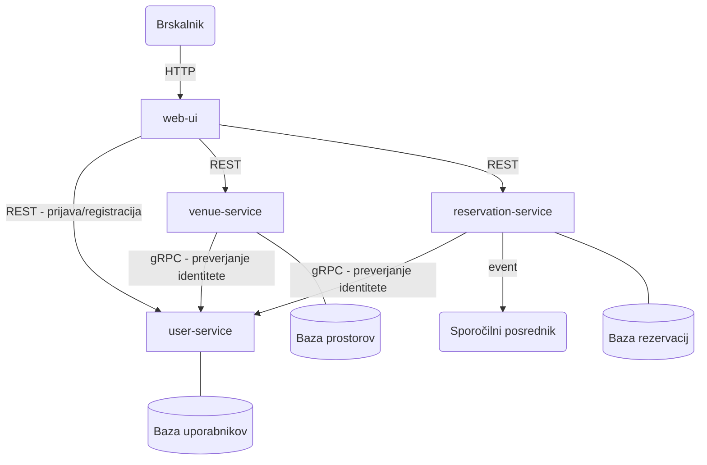

# Venue Rental

Platforma za oddajo in rezervacijo prostorov za zabave in dogodke.

Lastniki prostorov lahko objavijo svoje prostore, najemniki pa lahko pregledujejo ponudbo, ustvarijo rezervacijo in upravljajo s svojimi rezervacijami.

## Storitve

**user-service** – upravlja z uporabniškimi računi, registracijo, prijavo in vlogami (lastnik oz. najemnik). Izpostavlja REST API za spletni vmesnik (prijava, registracija) ter gRPC vmesnik, ki ga ostale storitve uporabljajo interno za preverjanje identitete uporabnika.

**venue-service** – upravlja s seznamom prostorov. Lastniki lahko dodajajo in urejajo svoje prostore, najemniki pa iščejo in pregledujejo razpoložljive prostore.

**reservation-service** – pokriva celoten postopek rezervacije: ustvarjanje rezervacije, potrditev ali odpoved ter preverjanje razpoložljivosti.

**web-ui** – spletni vmesnik v brskalniku, ki končnemu uporabniku omogoča dostop do vseh funkcionalnosti sistema.

## Arhitektura

Sistem je razdeljen na neodvisne mikrostoritve, vsaka s svojo podatkovno bazo. Spletni vmesnik komunicira z `venue-service` in `reservation-service` prek REST API-jev. Obe storitvi interno kličeta `user-service` prek gRPC za preverjanje identitete. `user-service` je prek REST dostopen tudi neposredno iz brskalnika za prijavo in registracijo. Sporočilni posrednik skrbi za asinhrono obdelavo dogodkov, kot je potrditev rezervacije.



## Komunikacija med storitvami

| Storitev | Protokol | Namen |
|---|---|---|
| `web-ui` → `user-service` | REST API | Prijava in registracija uporabnika |
| `web-ui` → `venue-service` | REST API | Prikaz in iskanje prostorov |
| `web-ui` → `reservation-service` | REST API | Ustvarjanje in pregled rezervacij |
| `venue-service` → `user-service` | gRPC | Preverjanje identitete lastnika |
| `reservation-service` → `user-service` | gRPC | Preverjanje identitete najemnika |
| `reservation-service` → sporočilni posrednik | RabbitMQ | Asinhrono obveščanje ob potrditvi/odpovedi rezervacije |

## Struktura projekta

```
venue-rental/
  user-service/        → upravljanje uporabnikov, avtentikacija
  venue-service/       → upravljanje prostorov in iskanje
  reservation-service/ → rezervacije in razpoložljivost
  web-ui/              → spletni vmesnik za končnega uporabnika
  docker-compose.yml
  README.md
```
