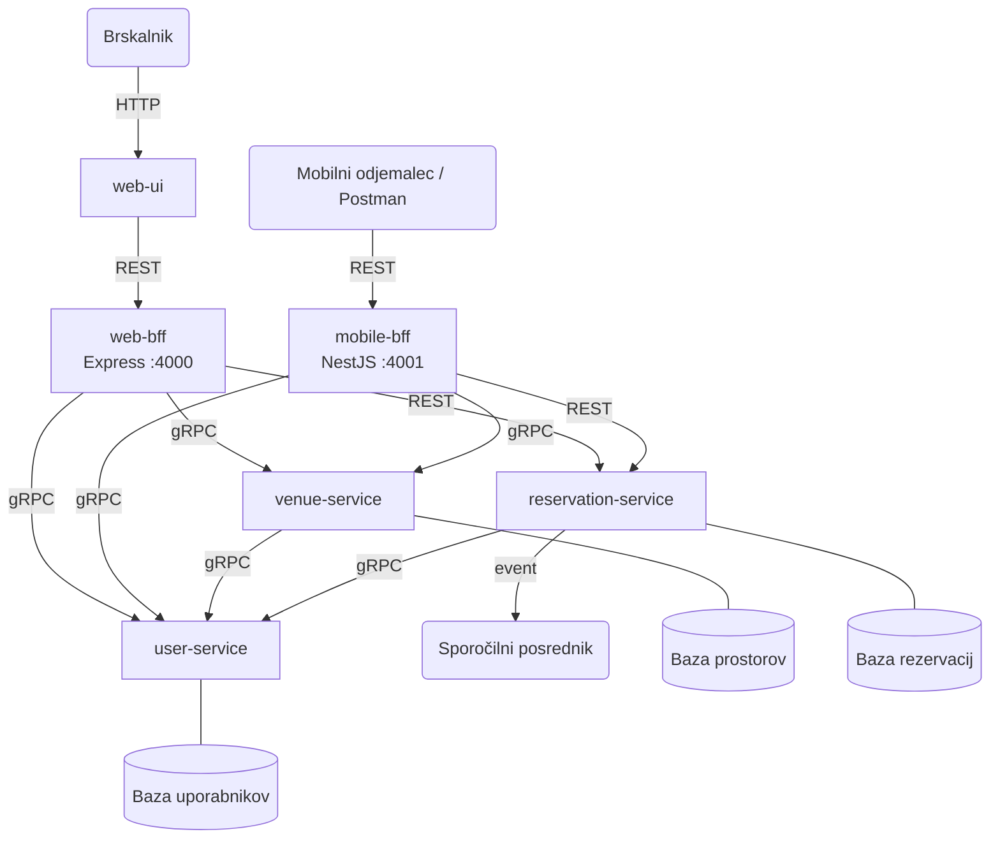

# Venue Rental

Platforma za oddajo in rezervacijo prostorov za zabave in dogodke.

Lastniki prostorov lahko objavijo svoje prostore, najemniki pa lahko pregledujejo ponudbo, ustvarijo rezervacijo in upravljajo s svojimi rezervacijami.

## Storitve

**user-service** – upravlja z uporabniškimi računi, registracijo, prijavo in vlogami (lastnik oz. najemnik). Izpostavlja REST API za spletni vmesnik (prijava, registracija) ter gRPC vmesnik, ki ga ostale storitve uporabljajo interno za preverjanje identitete uporabnika.

**venue-service** – upravlja s seznamom prostorov. Lastniki lahko dodajajo in urejajo svoje prostore, najemniki pa iščejo in pregledujejo razpoložljive prostore.

**reservation-service** – pokriva celoten postopek rezervacije: ustvarjanje rezervacije, potrditev ali odpoved ter preverjanje razpoložljivosti.

**web-ui** – spletni vmesnik v brskalniku, ki končnemu uporabniku omogoča dostop do vseh funkcionalnosti sistema.

**web-bff** – API prehod (Backend-for-Frontend) za spletni vmesnik. Edina vstopna točka za `web-ui`. Agregira klice na mikrostoritve (gRPC za user/venue, REST za reservation) in odjemalcu vrača polne odzive.

**mobile-bff** – API prehod za mobilne odjemalce. Izpostavlja enake vire kot `web-bff`, a z okrajšano obliko odgovorov (manj polj, manjši payload) za omejeno pasovno širino mobilnih naprav.

## Arhitektura

Sistem sledi vzorcu **Backend-for-Frontend (BFF)**: vsak tip odjemalca ima svoj API prehod, ki skrije heterogene mikrostoritve za svojim vmesnikom. Oba prehoda neodvisno kličeta iste tri mikrostoritve — tam, kjer je na voljo gRPC (user, venue), ga uporabljata; sicer REST. Spletni vmesnik komunicira izključno z `web-bff`. Sporočilni posrednik skrbi za asinhrono obdelavo dogodkov.



## Komunikacija med storitvami

| Storitev | Protokol | Namen |
|---|---|---|
| `web-ui` → `web-bff` | REST API | Enotna vstopna točka za spletni vmesnik |
| `mobilni odjemalec` → `mobile-bff` | REST API | Enotna vstopna točka za mobilni odjemalec (okrajšani odzivi) |
| `web-bff` / `mobile-bff` → `user-service` | gRPC | Preverjanje žetona, pridobivanje uporabnika |
| `web-bff` / `mobile-bff` → `venue-service` | gRPC + REST | gRPC za detajl prostora in preverjanje razpoložljivosti; REST za seznam, dodajanje, urejanje |
| `web-bff` / `mobile-bff` → `reservation-service` | REST | Rezervacija nima gRPC vmesnika |
| `venue-service` → `user-service` | gRPC | Preverjanje identitete lastnika |
| `reservation-service` → `user-service` | gRPC | Preverjanje identitete najemnika |
| `reservation-service` → sporočilni posrednik | RabbitMQ | Asinhrono obveščanje ob potrditvi/odpovedi rezervacije |

## Tehnologije

| Storitev | Jezik | Ogrodje | Baza | REST port | gRPC port |
|---|---|---|---|---|---|
| `user-service` | TypeScript | Express.js | PostgreSQL | 3001 | 50051 |
| `venue-service` | TypeScript | NestJS | PostgreSQL | 3002 | 50052 |
| `reservation-service` | TypeScript | Fastify | PostgreSQL | 3003 | – |
| `web-bff` | TypeScript | Express.js | – | 4000 | – |
| `mobile-bff` | TypeScript | NestJS | – | 4001 | – |
| `web-ui` | TypeScript | React + Vite | – | 80 | – |

## Demo skripta (E2E sprehod)

`scripts/demo-bffs.sh` izvede vsako pot na obeh BFF-jih po vrsti, izpiše `curl` ukaz in odgovor (HTTP status + lepo formatiran JSON). Uporabno za predstavitev, da vse deluje.

```bash
docker-compose up --build        # v enem terminalu
make demo                        # v drugem (ali: bash scripts/demo-bffs.sh)
```

Negativne primere (401, 400, podvojen email) vključi z `DEMO_INCLUDE_FAILURES=1 make demo`. Celoten zapis se shrani v `scripts/demo-bffs.log`.

## Demonstracija prehodov (Postman)

`web-bff` (polni odzivi, dodatne končne točke za upravljanje vsebin):

```
POST   http://localhost:4000/auth/register
POST   http://localhost:4000/auth/login
GET    http://localhost:4000/users/:id           # Bearer token (mobile-bff je nima)
GET    http://localhost:4000/venues
GET    http://localhost:4000/venues/:id          # gRPC → venue-service, agregira owner prek gRPC
GET    http://localhost:4000/venues/:id/details  # web-only: venue + owner + 7-dnevni koledar razpoložljivosti
POST   http://localhost:4000/venues              # OWNER; mobile-bff nima CRUD
PUT    http://localhost:4000/venues/:id          # OWNER
DELETE http://localhost:4000/venues/:id          # OWNER
POST   http://localhost:4000/reservations
GET    http://localhost:4000/reservations
PATCH  http://localhost:4000/reservations/:id/confirm   # OWNER (mobile-bff nima)
PATCH  http://localhost:4000/reservations/:id/cancel
```

`mobile-bff` (okrajšani odzivi, agregirane mobile-only končne točke):

```
POST http://localhost:4001/auth/register        # vrne samo id, email, role
POST http://localhost:4001/auth/login           # vrne samo token + {id, role}
GET  http://localhost:4001/venues               # vrne samo id, name, location, pricePerDay
GET  http://localhost:4001/venues/:id           # vrne samo osnovna polja
GET  http://localhost:4001/reservations         # Bearer token; brez renter_id, created_at, updated_at
PATCH http://localhost:4001/reservations/:id/cancel

# Mobile-only agregirane končne točke (web-bff jih nima):
GET  http://localhost:4001/mobile/home          # v enem klicu: featuredVenues + myUpcomingReservations
POST http://localhost:4001/mobile/quick-book    # body: {venueId, date} → avtomatsko preveri razpoložljivost + ustvari rezervacijo
```

**Razlike med prehodoma (primer):**

| | Web BFF | Mobile BFF |
|---|---|---|
| Ogrodje | Express | NestJS |
| Polja v venue odzivu | vse (opis, lastnik, časovne oznake) | 4 osnovna polja |
| Edinstvene končne točke | `/venues/:id/details`, `/users/:id`, CRUD za prostore, `/reservations/:id/confirm` | `/mobile/home`, `/mobile/quick-book` |
| Namen | Bogati pogledi za širok zaslon | Manj zahtevkov in manjši payload za mobilne naprave |

## Struktura projekta

```
venue-rental/
  user-service/        → upravljanje uporabnikov, avtentikacija
  venue-service/       → upravljanje prostorov in iskanje
  reservation-service/ → rezervacije in razpoložljivost
  web-bff/             → API prehod za spletni vmesnik (Express)
  mobile-bff/          → API prehod za mobilne odjemalce (NestJS)
  web-ui/              → spletni vmesnik za končnega uporabnika
  docker-compose.yml
  README.md
```
