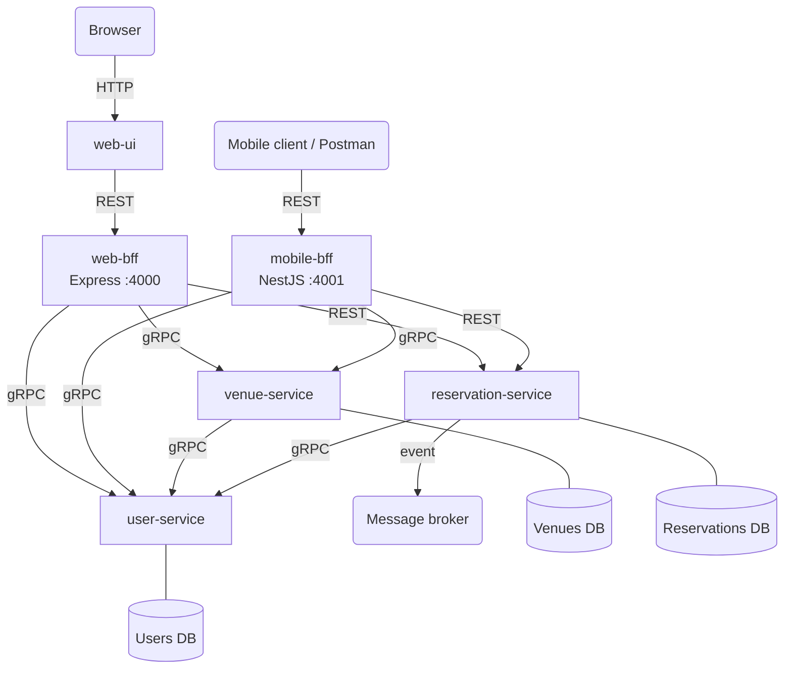

# Venue Rental

A microservices platform for listing and booking event venues. Venue owners can publish their spaces; renters can browse, reserve, and manage their bookings.

> Slovenian version: [readme-slo.md](readme-slo.md)

## Architecture

The system follows the **Backend-for-Frontend (BFF)** pattern: each client type has a dedicated API gateway that hides the internal microservice heterogeneity. Both gateways independently call the same three backend services — using gRPC where available, REST otherwise. The browser communicates exclusively with `web-bff`.


```mermaid
graph TD
    Browser(Browser)
    Mobile(Mobile client / Postman)

    Browser -->|HTTP| WebUI[web-ui]
    WebUI -->|REST| WebBFF[web-bff<br/>Express :4000]
    Mobile -->|REST| MobileBFF[mobile-bff<br/>NestJS :4001]

    WebBFF -->|gRPC| UserService[user-service]
    WebBFF -->|gRPC| VenueService[venue-service]
    WebBFF -->|REST| ReservationService[reservation-service]

    MobileBFF -->|gRPC| UserService
    MobileBFF -->|gRPC| VenueService
    MobileBFF -->|REST| ReservationService

    VenueService -->|gRPC| UserService
    ReservationService -->|gRPC| UserService

    ReservationService -->|event| Broker(Message broker)

    UserService --- DB1[(Users DB)]
    VenueService --- DB2[(Venues DB)]
    ReservationService --- DB3[(Reservations DB)]
```

## Services

All services are written in **TypeScript**. Each backend service uses a different Node.js framework — intentionally, to demonstrate that microservices can evolve independently with different technology choices:

| Service | Framework | Why |
|---|---|---|
| `user-service` | Express.js | Minimal, full control — suits the clean-architecture layering |
| `venue-service` | NestJS | Decorator-based DI and module structure for a larger domain |
| `reservation-service` | Fastify | Schema validation and performance focus for the write-heavy service |
| `web-bff` | Express.js | Lightweight aggregation layer |
| `mobile-bff` | NestJS | Consistent with venue-service; DI helps with circuit breaker wiring |
| `web-ui` | React + Vite | – |

| Service | DB | REST | gRPC |
|---|---|---|---|
| `user-service` | PostgreSQL | :3001 | :50051 |
| `venue-service` | PostgreSQL | :3002 | :50052 |
| `reservation-service` | PostgreSQL | :3003 | – |
| `web-bff` | – | :4000 | – |
| `mobile-bff` | – | :4001 | – |
| `web-ui` | – | :80 | – |

**user-service** — manages user accounts, registration, login, and roles (owner / renter). Structured with **Clean Architecture**: domain entities and repository interfaces are fully decoupled from infrastructure (Postgres, gRPC adapters). Exposes a Swagger UI at `/api-docs`. Uses gRPC internally for identity verification by other services.

**venue-service** — manages the venue catalogue. Owners can add and edit venues; renters can browse and view availability.

**reservation-service** — covers the full reservation lifecycle: creation, confirmation, cancellation, and availability checking. Publishes events to a RabbitMQ `direct` exchange with routing keys `reservation.created`, `reservation.confirmed`, and `reservation.cancelled` (durable queue, persistent messages).

**web-bff** — API gateway for the browser client. The single entry point for `web-ui`; aggregates gRPC + REST calls and returns full responses. Implements a circuit breaker for resilience.

**mobile-bff** — API gateway for mobile clients. Exposes the same resources as `web-bff` but with trimmed payloads (fewer fields, smaller responses) for constrained bandwidth.

**web-ui** — browser frontend built as a microfrontend shell with federated `venues-mfe` and `reservations-mfe` modules.

## Inter-service Communication

| Caller → Callee | Protocol | Purpose |
|---|---|---|
| `web-ui` → `web-bff` | REST | Single entry point for the browser |
| mobile client → `mobile-bff` | REST | Single entry point for mobile (trimmed responses) |
| BFFs → `user-service` | gRPC | Token verification, user lookup |
| BFFs → `venue-service` | gRPC + REST | gRPC for venue detail and availability; REST for CRUD |
| BFFs → `reservation-service` | REST | Reservation service has no gRPC interface |
| `venue-service` → `user-service` | gRPC | Owner identity verification |
| `reservation-service` → `user-service` | gRPC | Renter identity verification |
| `reservation-service` → broker | RabbitMQ | Async notification on confirmation / cancellation |

## Key Patterns & Features

- **BFF (Backend-for-Frontend)** — separate gateways for web and mobile clients
- **gRPC** — strongly-typed internal communication with Protobuf schemas
- **Circuit Breaker** (Opossum) — per-method breakers on all BFF→service calls; see below
- **Distributed Tracing** — OpenTelemetry + Jaeger; traces span across all services
- **Clean Architecture** — `user-service` separates domain entities, repository interfaces, use cases, and infrastructure adapters
- **Swagger / OpenAPI** — `user-service` serves interactive docs at `GET /api-docs`
- **Message Queue** — RabbitMQ `direct` exchange; routing keys per event type; durable queue + persistent messages
- **Microfrontend** — Module Federation shell with independently deployable MFEs
- **Container Orchestration** — OpenShift manifests with HPA and NetworkPolicies

## Circuit Breaker

Every outgoing call from the BFFs (and from `reservation-service`) is wrapped in an [Opossum](https://nodeshift.dev/opossum/) circuit breaker. The implementation uses **per-method granularity** — one breaker per `(downstream service × method)` — so a slow `reservation.list` doesn't trip the breaker for `venue.getVenue`.

**States:** `CLOSED` (normal) → `OPEN` (fast-fail, no traffic sent downstream) → `HALF-OPEN` (one probe call) → back to `CLOSED` on success.

**Configuration used:** 3 s timeout, 50% error threshold, 10 s reset, minimum 3 calls before the threshold is evaluated.

**Fallback strategy varies by criticality:**
- List/read endpoints → return a degraded stub (`{ items: [], degraded: true }`) so the page still loads
- `checkAvailability` → return `false` (conservative: rather show "unavailable" than a false confirmation)
- `verifyToken` and write paths → no fallback; propagate the error so authentication can't be silently bypassed

**Diagnostic endpoint** — each service exposes `GET /admin/breakers`:

```bash
curl http://localhost:4000/admin/breakers | jq
# → { "breakers": [{ "name": "reservation.list", "state": "open", "stats": { ... } }] }
```


## Running Locally

```bash
docker-compose up --build        # start all services
make demo                        # E2E walkthrough of all BFF endpoints
make demo-cb                     # circuit breaker demo (stops reservation-service mid-run)
```

`scripts/demo-bffs.sh` walks through every endpoint on both BFFs, printing the `curl` command and formatted JSON response. Include failure cases with `DEMO_INCLUDE_FAILURES=1 make demo`. The full run is saved to `scripts/demo-bffs.log`.

`scripts/demo-circuit-breaker.sh` automates the circuit breaker demo: seeds venues, fires requests, stops `reservation-service`, shows the breaker opening and responses degrading, then restarts the service and shows automatic recovery.

To seed venues without running the full demo:

```bash
bash scripts/seed-venues.sh
```

## API Endpoints

### web-bff (full responses, content management)

```
POST   /auth/register
POST   /auth/login
GET    /users/:id                      # Bearer token required (mobile-bff omits this)
GET    /venues
GET    /venues/:id                     # gRPC → venue-service, aggregates owner via gRPC
GET    /venues/:id/details             # web-only: venue + owner + 7-day availability calendar
POST   /venues                         # OWNER role
PUT    /venues/:id                     # OWNER role
DELETE /venues/:id                     # OWNER role
POST   /reservations
GET    /reservations
PATCH  /reservations/:id/confirm       # OWNER (mobile-bff omits this)
PATCH  /reservations/:id/cancel
```

### mobile-bff (trimmed responses, mobile-only aggregates)

```
POST  /auth/register        # returns only id, email, role
POST  /auth/login           # returns only token + {id, role}
GET   /venues               # returns only id, name, location, pricePerDay
GET   /venues/:id           # returns only core fields
GET   /reservations         # Bearer token; omits renter_id, created_at, updated_at
PATCH /reservations/:id/cancel

# Mobile-only aggregate endpoints (not in web-bff):
GET  /mobile/home           # single call: featuredVenues + myUpcomingReservations
POST /mobile/quick-book     # body: {venueId, date} → checks availability + creates reservation
```

### BFF Comparison

| | web-bff | mobile-bff |
|---|---|---|
| Framework | Express | NestJS |
| Venue response fields | all (description, owner, timestamps) | 4 core fields |
| Unique endpoints | `/venues/:id/details`, `/users/:id`, venue CRUD, `/reservations/:id/confirm` | `/mobile/home`, `/mobile/quick-book` |
| Purpose | Rich views for desktop | Fewer requests, smaller payloads for mobile |

## Project Structure

```
venue-rental/
  user-service/        → user management, authentication
  venue-service/       → venue catalogue and search
  reservation-service/ → reservations and availability
  web-bff/             → API gateway for browser (Express)
  mobile-bff/          → API gateway for mobile (NestJS)
  web-ui/              → browser frontend (React + Module Federation)
  openshift/           → OpenShift deployment manifests
  docker-compose.yml
```

## Deployment

See [openshift/README.md](openshift/README.md) for deploying to an OpenShift cluster (Red Hat Developer Sandbox or any OpenShift 4.x).
